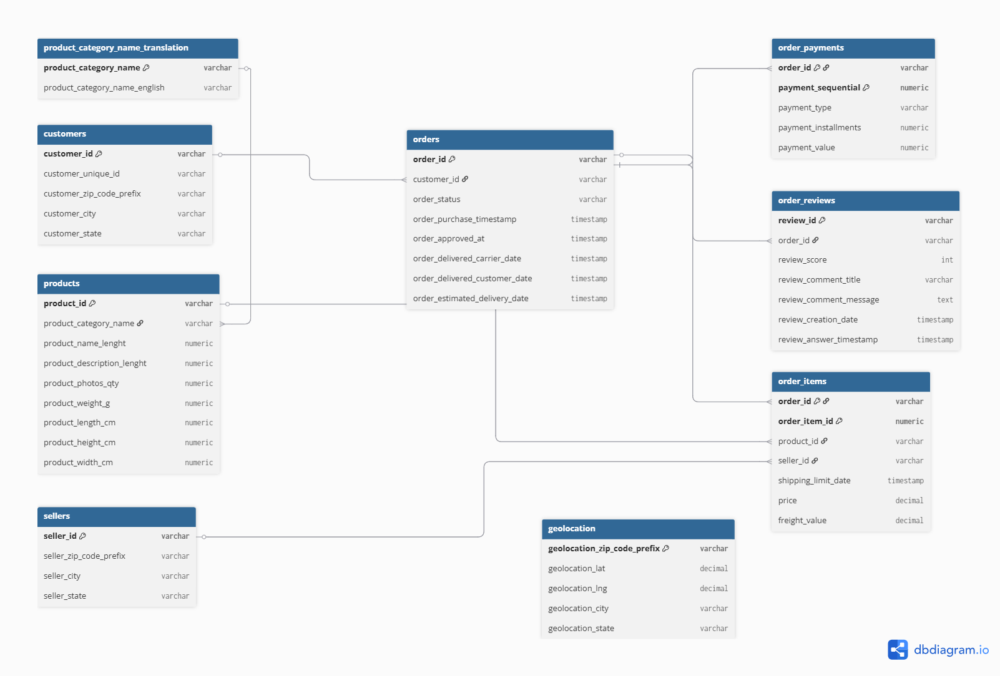
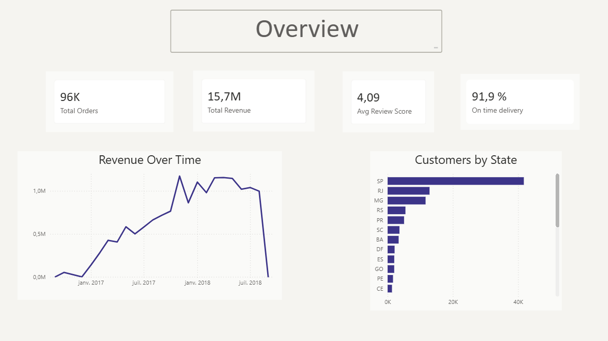

# Olist E-Commerce - SQL Analysis

Olist is a real Brazilian e-commerce platform that connects small merchants to large marketplaces.  
This project explores 96k+ real orders through SQL to answer business questions across six domains.  
The goal of this project is to identify customer behavior patterns, delivery performance issues, and seller quality gaps.

## What is Olist?

Olist acts as a bridge between small sellers and big marketplaces in Brazil.  
The dataset contains orders, customers, products, payments and reviews collected between 2016 and 2018.

## Database Schema

## Analysis - Six Business Domains

### Customer Behavior - Who are the customers and how do they buy?
- Geographic distribution of customers across Brazil
- What percentage of customers are one-time buyers vs returning?
- Average basket size by state

###  Delivery Performance - Is the delivery promise being kept?
- Which states have the highest late delivery rate?
- What percentage of orders arrive late?
- Are delays concentrated on specific sellers?
- Do late orders get significantly lower review scores?

### Payment Analysis - How and how much do customers pay?
- Breakdown of payment methods (credit card, boleto, voucher…)
- Do customers who pay in installments spend more?

### Review Analysis - What drives customer satisfaction?
- Distribution of review scores (1 to 5) in percentage
- Are negative reviews (1, 2) linked to late deliveries?
- Which product categories have the best and worst ratings?
- Does Olist respond faster to negative reviews?

### Seller Performance - Which sellers perform and why?
- Top 10 sellers by revenue generated
- Seller segmentation: High Value / At Risk / Low Performer

### Sales Analysis - When, what and where do products sell?
- Monthly revenue trend
- Which product categories generate the most revenue?
- Is there a seasonal pattern in orders?

## Dataset

Source: [Kaggle — Brazilian E-Commerce Public Dataset by Olist](https://www.kaggle.com/datasets/olistbr/brazilian-ecommerce)

| Table | Description |
|---|---|
| `customers` | Customer info and location |
| `orders` | Order status and timestamps |
| `order_items` | Products and sellers per order |
| `order_payments` | Payment method and value |
| `order_reviews` | Customer scores and comments |
| `products` | Product attributes and category |
| `sellers` | Seller info and location |
| `geolocation` | Zip codes with coordinates |
| `product_category_name_translation` | Category names in English |

## Key Findings

- Revenue grew steadily from 2016 to a peak in November 2017 (likely Black Friday), 
  then drops sharply in September 2018 due to dataset truncation
- São Paulo accounts for 42% of total customers, confirming strong geographic concentration
- 94% of customers are one-time buyers, significant retention challenge for the platform
- Strong correlation between late deliveries and negative reviews (avg score 2.5 vs 4.3 for on-time)
- Only 0.17% of sellers reach High Value status, major vendor quality gap on the platform
- Credit card dominates with 74% of payments

## Dashboard

[View Full Dashboard](./dashboard/olist_dashboard.pdf)

## Tech Stack

- **Database:** PostgreSQL
- **Language:** SQL
- **Visualization:** Power BI
- **Dataset:** Olist via Kaggle
